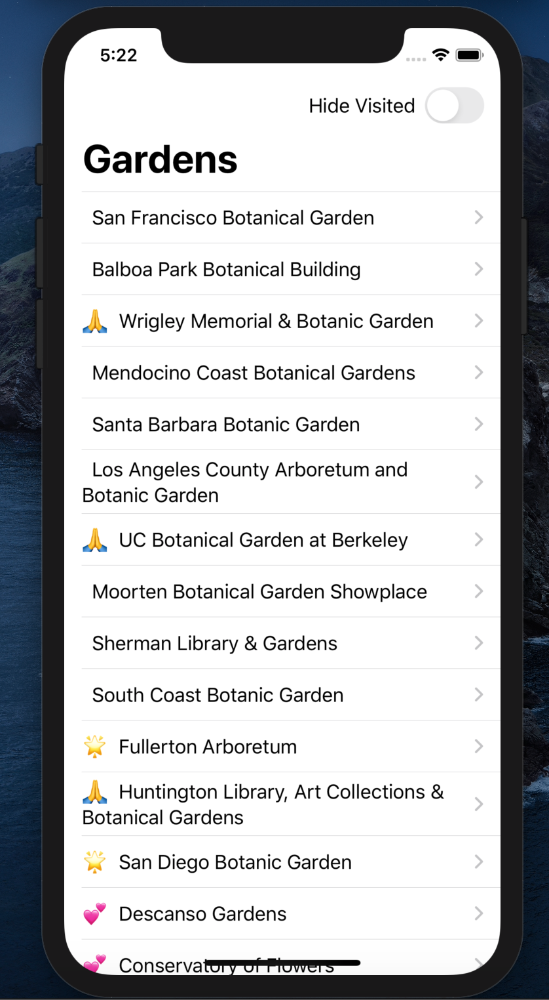
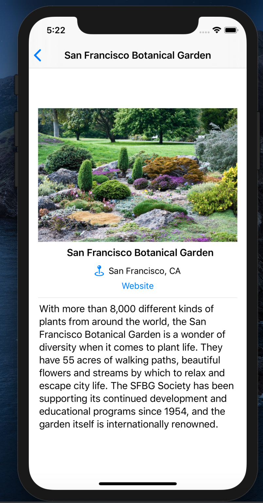
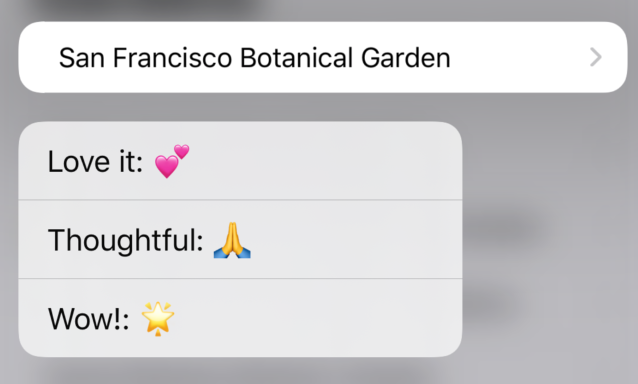

# GardensViewer

<h1 align="center">
  Main Screen
</h1>

  

<h1 align="center">
  Detail View
</h1>

  

<h1 align="center">
  Reactions
</h1>

  

<h1 align="center">
  Details
</h1>

  Gardens is a textbook application which uses many advanced StoryBoard elements. Users can view a list of gardens, mark the ones they have visited, give reaction to gardens, and see garden details.

